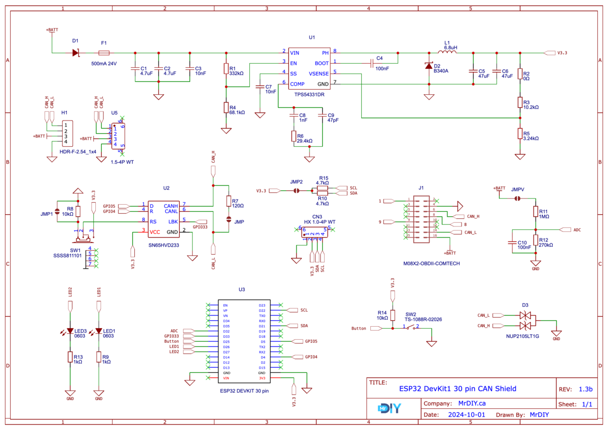

# CAN-BUS Diagnostic Tool

[](LICENSE)
[](https://github.com/simantkhadka/CAN-BUS-Diagonostic-tool/stargazers)
[](https://github.com/simantkhadka/CAN-BUS-Diagonostic-tool)

---

##  Overview

**What is this?**  
A rugged ESP32-based CAN bus diagnostic system exposing OBD-II Modes 01–06, real-time telemetry, DTC reading/clearing, and on-board tests via USB, Bluetooth, and Wi-Fi.

**Why it matters:**  
Use this tool to monitor vehicle diagnostics, debug ECU data, or prototype a CAN-bus application—without expensive tools like OBD-link or proprietary scanners.

---

##  Demo

<!-- Replace with actual gif or video -->


<video controls width="600">
  <source src="demo/live-demo.mp4" type="video/mp4">
  Your browser does not support the video tag.
</video>

Or embed YouTube (unlisted):  
[](https://www.youtube.com/watch?v=YOUR_VIDEO_ID)

---

##  Architecture Overview

Insert your schematic here:



**Software stack diagram:**  
- Firmware (ESP32): CAN controller interface, OBD-II mode logic  
- Host interface: Wi-Fi API / Serial / Bluetooth shell  
- Client tooling: Python CLI / JavaScript Dashboard / App (as applicable)

---

##  Quick Start

### 🧰 Hardware
- **ESP32 Dev Board** (e.g., ESP32-WROOM-32)
- **CAN Transceiver / MCP2551** (or shield with MCP2515)
- **OBD-II to DB9 cable** (specify connector types)

###  Software (Host)
- PlatformIO or Arduino IDE (specify version)
- Libraries:
  - `CAN.h` / `ESP32CAN`
  - [List others]

###  Setup Steps
```bash
git clone https://github.com/simantkhadka/CAN-BUS-Diagonostic-tool.git
cd CAN-BUS-Diagonostic-tool
# Option A: PlatformIO
pio run && pio run -t upload
# Option B: Arduino CLI / IDE
# (describe steps)
