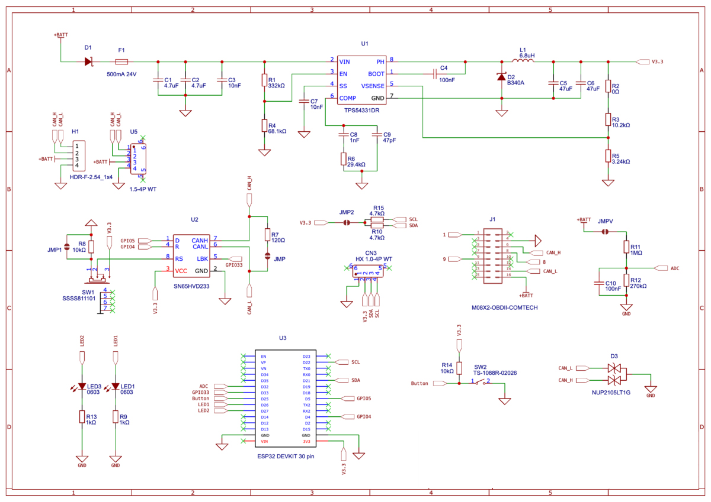

# 🚗 Automotive CAN Bus Diagnostic Tool  

  
  
  

---

## 📖 Overview  

The **Automotive CAN Bus Diagnostic Tool** is an **ESP32-based open-source platform** for analyzing and interacting with vehicle networks through the OBD-II port.  

It enables:  
- 📊 Real-time vehicle data monitoring  a
- 🔍 CAN traffic sniffing and reverse engineering  
- 🛠️ Diagnostic Trouble Code (DTC) reading/clearing  
- 🌐 Connectivity via USB, Bluetooth, and Wi-Fi  

This project bridges **embedded firmware, automotive diagnostics, and cybersecurity research** — providing a **professional-grade tool** for enthusiasts, engineers, and researchers.  

---

## ✨ Features  

| Feature | Description |
|---------|-------------|
| 🛠️ **OBD-II Modes 01–06** | Live data, freeze frames, DTC retrieval/clearing, O₂ sensor monitoring, and on-board test results — a complete diagnostic workflow. |
| 📡 **Real-Time CAN Analysis** | Sniff, log, and replay raw CAN frames for reverse engineering, anomaly detection, and hidden signal discovery. |
| 🔗 **Flexible Connectivity** | USB Serial, Bluetooth ELM327 emulation (works with Torque, Car Scanner), or Wi-Fi AP with dashboard/API. |
| ⚡ **Portable ESP32 Design** | Compact hardware with LED indicators for CAN init and RX/TX activity. Plug-and-play across vehicles. |
| 🔒 **Security & Research Ready** | Inject custom CAN frames and perform MITM experiments for cybersecurity research. |
| 🌍 **Cross-Platform & Extensible** | Works on Windows, Linux, macOS, Android. Modular firmware lets you add new PIDs and extend features. |

---
## 🎥 Demo Video 

https://github.com/user-attachments/assets/0c0959b6-6710-476d-8ff5-35bfcdc2d654

https://github.com/user-attachments/assets/2b88c9d3-b2f6-4418-abd5-e2d6fecdbec8

https://github.com/user-attachments/assets/79f9b519-6360-4b1a-ae00-c602bd278794

---

## 🔌 Hardware Setup  

### Required Components  
- ESP32 Development Board  
- MCP2515 CAN Controller / Shield  
- OBD-II Adapter Cable  
- Power source (vehicle battery or bench supply)  

### Shield Schematic

### Wiring

### Hardware Setup  

